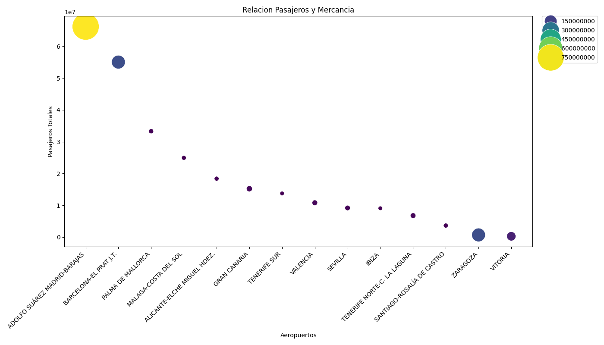
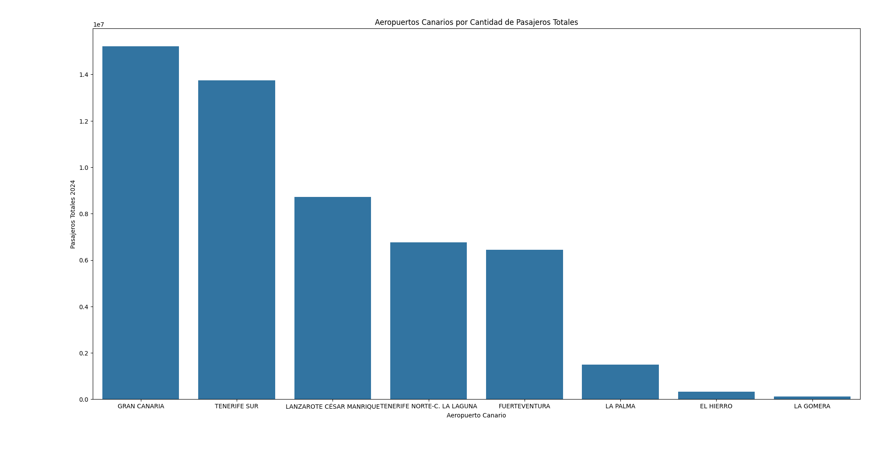

# **Proyecto de Análisis de AENA 2024: De Datos Caóticos a un Modelo Predictivo**

Este proyecto es un análisis completo del tráfico aéreo en los aeropuertos españoles gestionados por AENA durante 2024\. El objetivo era tomar un archivo de datos público y desestructurado, limpiarlo, extraer *insights* de negocio y, finalmente, construir un modelo de Machine Learning para predecir el impacto de nuevas operaciones aéreas.

Este proyecto demuestra un ciclo completo de Ciencia de Datos:

1. **Limpieza de Datos (ETL)**  
2. **Análisis Exploratorio de Datos (EDA)**  
3. **Modelo de Machine Learning (Predicción)**  
4. **Aplicación de Negocio (Simulación)**

## **1\. Limpieza de Datos (limpieza\_datos.py)**

El archivo original (DEFINITIVOS+2024.xlsx \- AÑO 2024.csv) era un informe complejo que contenía tres tablas (Pasajeros, Operaciones, Mercancía) en una sola hoja, con cabeceras y filas vacías.

* Se creó un script para leer el CSV 3 veces, extrayendo las columnas relevantes de cada tabla y uniéndolas.  
* **Se identificaron y filtraron los aeropuertos no españoles** (Brasil, Reino Unido) y las filas de totales, creando un dataset final puramente español y limpio.  
* El resultado es aena\_2024\_limpio.csv, un archivo listo para el análisis.

## **2\. Análisis Exploratorio de Datos (estudio\_aena2024.py)**

Mi análisis reveló que los aeropuertos españoles se dividen en 3 grupos claros:

### **Insight 1: Los 3 Tipos de Aeropuertos Españoles**

La relación entre pasajeros y mercancía define el rol de cada aeropuerto:

1. **Turísticos y Hubs:** (Madrid, Barcelona, Palma, Gran Canaria). Alto volumen de pasajeros y alta eficiencia.  
2. **Gigantes Logísticos:** (Zaragoza, Vitoria). Bajo volumen de pasajeros, pero dominan el tráfico de mercancías (carga aérea).  
3. **Aeródromos Regionales:** (Son Bonet, Sabadell). Alto número de operaciones (vuelos de escuela) pero muy pocos pasajeros.

   

*Gráfico de burbujas: Eje Y (Pasajeros), Tamaño de la burbuja (Mercancía). Se pueden ver los 3 grupos:*

### **Insight 2: La Recuperación Post-Pandemia**

Los aeropuertos "revelación" (mayor crecimiento desde 2019, usando la métrica % Inc 2024 /s 2019) no son los más grandes. Son aeródromos pequeños y regionales que se han recuperado con fuerza.

### **Insight 3: El Ecosistema Canario**

Dentro de Canarias, Gran Canaria y Tenerife Sur dominan el tráfico, seguidos por Lanzarote y Tenerife Norte.

## **3\. Modelo de Machine Learning (modelo\_ml.py)**

El análisis de "eficiencia" mostró una relación lineal casi perfecta entre el número de operaciones (vuelos) y el número de pasajeros. Decidí cuantificar esto con un modelo de Regresión Lineal.

* **Objetivo:** Predecir pasajeros\_total usando operaciones\_total como variable.  
* **Evaluación:** El modelo se probó en un conjunto de datos oculto (20% del total), alcanzando una **fiabilidad (Nota R2) del 99.1%**.

### **4\. Aplicación de Negocio: Simulación "What-If"**

Para demostrar la utilidad del modelo, lo apliqué a un escenario de negocio en Gran Canaria.

**Pregunta:** Si el Aeropuerto de Gran Canaria añade 5,000 nuevas operaciones (vuelos) el próximo año, ¿cuántos pasajeros extra podemos esperar?

**Respuesta del Modelo:**

* **Pasajeros Actuales:** 15,219,843  
* **Impacto Estimado:** **\+1.38 millones de pasajeros extra** (aproximadamente 276 pasajeros por cada vuelo extra).

Este modelo transforma un simple archivo CSV en una herramienta de predicción estratégica.
